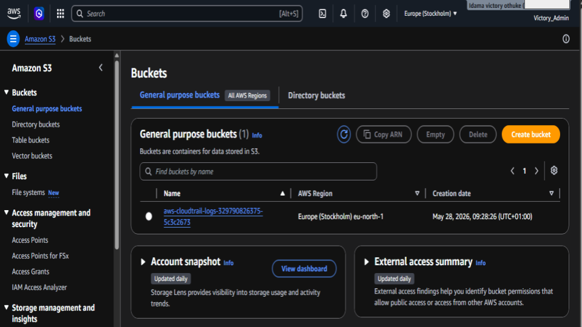
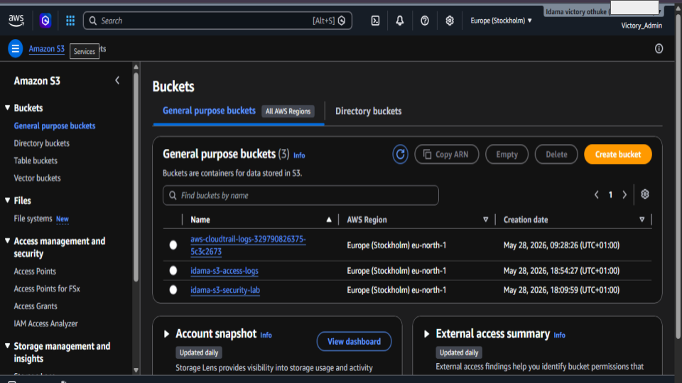
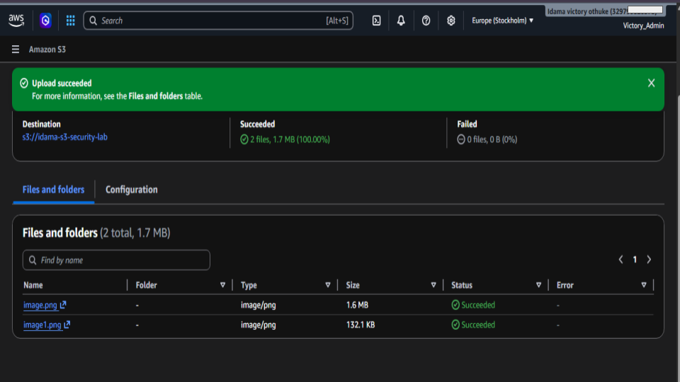
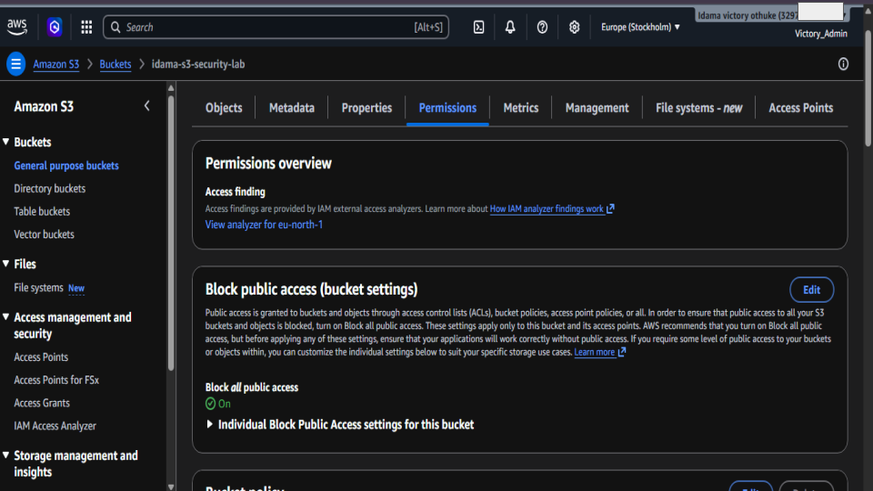
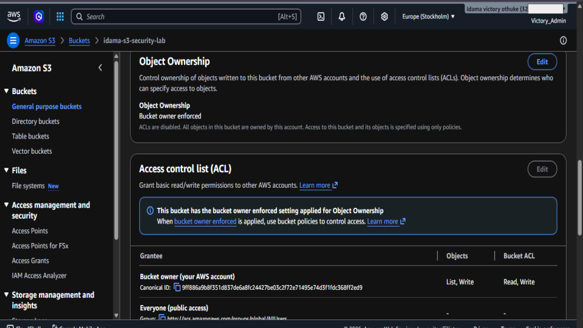
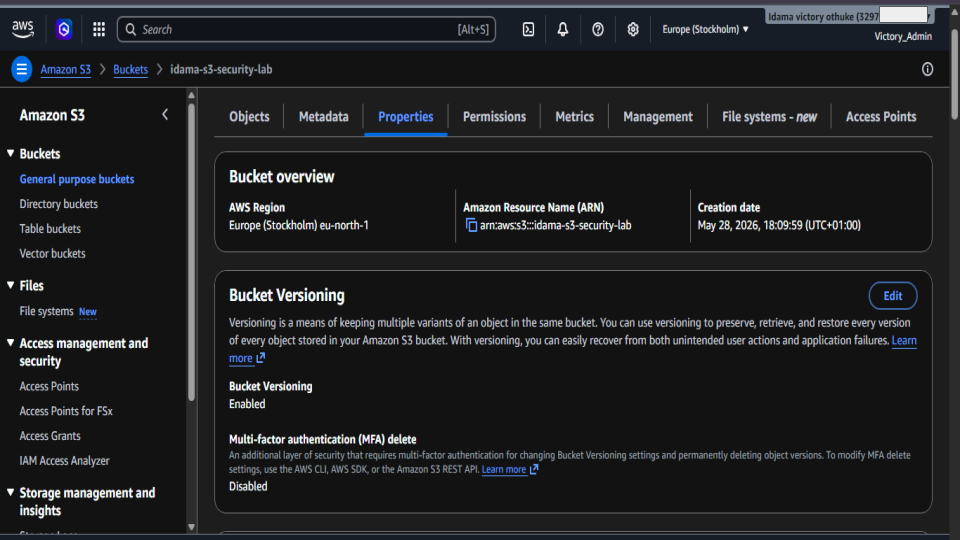
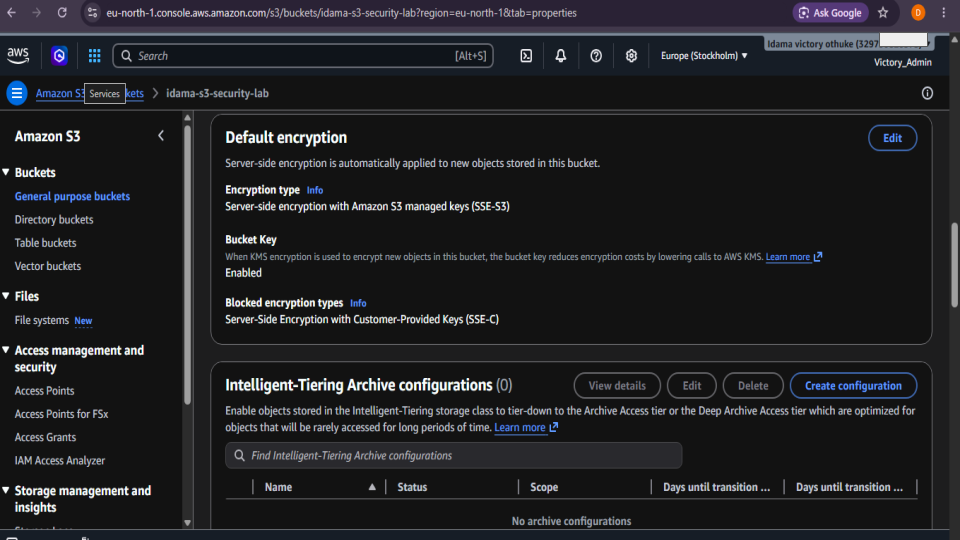
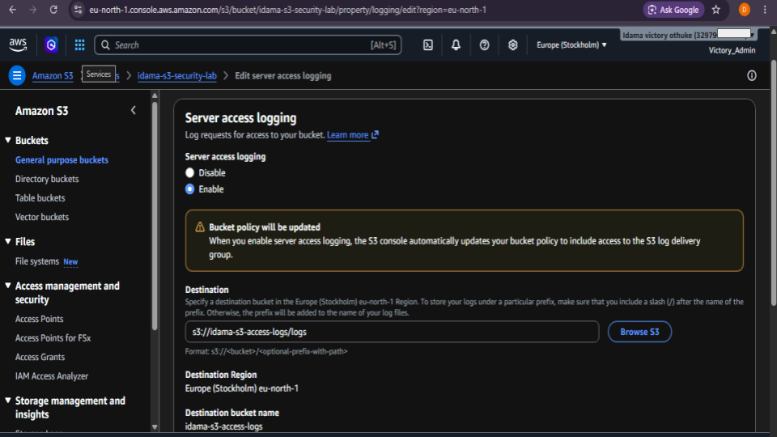
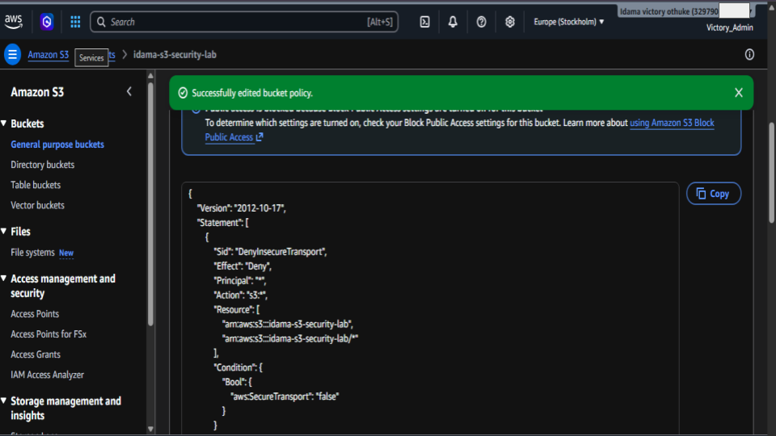
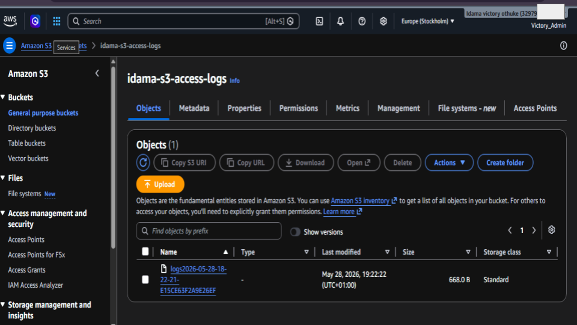

# AWS S3 Bucket Hardening Project

## Overview
This project demonstrates how I secured an Amazon S3 bucket using AWS security best practices.

## What I Implemented
- Created secure S3 buckets
- Enabled Block Public Access
- Enabled Bucket Versioning
- Configured Server-Side Encryption (SSE-S3)
- Enabled Server Access Logging
- Applied secure bucket policy to deny insecure HTTP requests
- Uploaded sample files to test bucket security

## Security Features
- Data encryption at rest
- Protection against accidental deletion
- Public access prevention
- Access activity logging
- Secure HTTPS-only access

## Tools Used
- AWS S3
- AWS IAM
- AWS Bucket Policies
- Server Access Logging

### 📊 Evidence 

<h4 align="center">In this step, I accessed the Amazon S3 service from the AWS Management Console to begin my S3 Bucket Hardening Project</h4>

    

<h4 align="center">In this step, I created multiple Amazon S3 buckets to separate storage functions and improve security management within the AWS environment.</h4>

    

<h4 align="center">In this step, I uploaded test image files into my secured Amazon S3 bucket named “idama-s3-security-lab.</h4>

    

<h4 align="center">In this step, I opened my S3 bucket named idama-s3-security-lab and navigated to the Permissions tab to review the bucket security settings</h4>

    

<h4 align="center">In this step, I reviewed the Access Control List (ACL) and Object Ownership settings for my Amazon S3 bucket </h4>

    

<h4 align="center">In this step, I configured and reviewed Bucket Versioning for the S3 bucket</h4>

    

<h4 align="center">In this step, I reviewed and configured Default Encryption for the Amazon S3 bucket</h4>

    

<h4 align="center">In this step, I enabled Server Access Logging for the Amazon S3 bucket.</h4>

    

<h4 align="center">In this step, I configured and applied a custom Bucket Policy to improve the security of the Amazon S3 bucket</h4>

    

<h4 align="center">In this final step, I verified that Server Access Logging was working successfully by reviewing the generated log file inside the dedicated log bucket named idama-s3-access-logs.</h4>

    

All screenshots are here:

🔗 [Google Slides](https://docs.google.com/presentation/d/1XvTQWIryIov448CAUJaseOLbNg_tPbCARQgxPpbQSUk/edit?usp=sharing)

> Note: Sensitive account information was blurred for security purposes before publication.

## Project Outcome
Successfully built and hardened an AWS S3 environment for secure cloud storage and monitoring.

## Author
**Idama Victory Othuke**  
SOC Analyst | Cloud Security  Engineer Enthusiast
